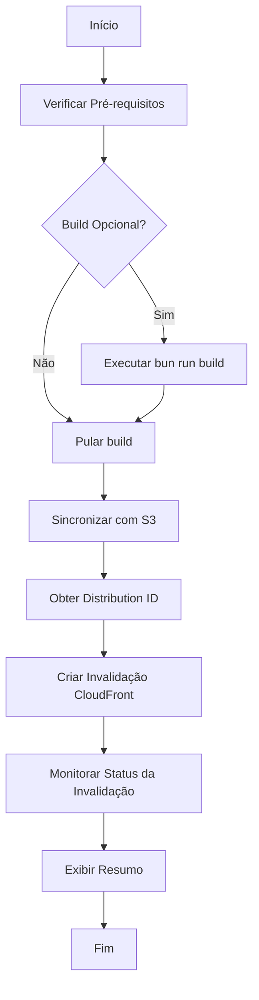

# Plano: Script de Deploy do Site para S3 + CloudFront

## 📋 Visão Geral

Criar um script bash em `/infra/scripts/deploy-site.sh` que automatize o processo de deploy do site Next.js para o S3 bucket `geborges-com-site` com suporte a invalidação de cache do CloudFront.

---

## 🎯 Objetivos

1. **Build do site**: Executar o build do Next.js (opcional)
2. **Sincronização com S3**: Upload dos arquivos estáticos para o bucket S3
3. **Invalidação do CloudFront**: Limpar o cache da distribuição CloudFront
4. **Validação**: Verificar se o deploy foi bem-sucedido

---

## 📐 Arquitetura do Script

### Fluxo de Execução



---

## 🔧 Componentes do Script

### 1. Configuração

```bash
# Variáveis de configuração
S3_BUCKET="geborges-com-site"
WEBSITE_DIR="../website"
BUILD_DIR="${WEBSITE_DIR}/dist"
CLOUDFRONT_DISTRIBUTION_ID=""  # Obtido via Terraform ou AWS CLI
INVALIDATION_PATHS="/*"         # Invalidar todo o cache
```

### 2. Pré-requisitos

- AWS CLI v2 instalado
- AWS SSO session ativa
- Bun instalado (para build do Next.js)
- Permissões IAM necessárias:
  - `s3:PutObject`, `s3:DeleteObject`, `s3:ListBucket`
  - `cloudfront:CreateInvalidation`, `cloudfront:GetInvalidation`

### 3. Funções Principais

#### `check_prerequisites()`
- Verificar se AWS CLI está instalado
- Verificar se o perfil AWS existe
- Verificar se a sessão SSO está ativa
- Verificar se Bun está instalado (se build for necessário)

#### `build_site()`
- Navegar para o diretório do website
- Executar `bun run build`
- Verificar se o build foi bem-sucedido

#### `sync_to_s3()`
- Sincronizar o diretório `dist/` com o bucket S3
- Usar `aws s3 sync` com flags:
  - `--delete`: Remover arquivos que não existem mais no build
  - `--cache-control`: Definir headers de cache
  - `--exclude`: Excluir arquivos desnecessários

#### `get_cloudfront_distribution_id()`
- Obter o ID da distribuição CloudFront via AWS CLI
- Filtrar pelo comentário "CDN for geborges.com"

#### `invalidate_cloudfront()`
- Criar invalidação no CloudFront
- Usar `aws cloudfront create-invalidation`
- Retornar o ID da invalidação

#### `wait_for_invalidation()`
- Monitorar o status da invalidação
- Aguardar até que a invalidação seja completada
- Exibir progresso

#### `display_summary()`
- Exibir resumo do deploy
- Mostrar arquivos sincronizados
- Mostrar status da invalidação

---

## 📝 Estrutura do Script

```bash
#!/bin/bash

# =============================================================================
# Site Deployment Script for S3 + CloudFront
# =============================================================================

set -e  # Exit on error

# Configuration Variables
S3_BUCKET="geborges-com-site"
WEBSITE_DIR="../website"
BUILD_DIR="${WEBSITE_DIR}/dist"
INVALIDATION_PATHS="/*"

# Functions
usage() { ... }
check_prerequisites() { ... }
build_site() { ... }
sync_to_s3() { ... }
get_cloudfront_distribution_id() { ... }
invalidate_cloudfront() { ... }
wait_for_invalidation() { ... }
display_summary() { ... }

# Main
main() {
    # Parse arguments
    # Check prerequisites
    # Build site (optional)
    # Sync to S3
    # Invalidate CloudFront
    # Display summary
}

main "$@"
```

---

## 🚀 Opções de Linha de Comando

```bash
deploy-site.sh [OPTIONS]

Options:
  -p, --profile       AWS CLI profile name (required)
  -r, --region        AWS region (default: us-east-1)
  -b, --build         Build the site before deploying (default: false)
  -w, --wait          Wait for CloudFront invalidation to complete (default: true)
  -d, --dry-run       Show what would be done without executing (default: false)
  -h, --help          Display help message
```

---

## 📊 Exemplos de Uso

### Deploy sem build (assumindo que já foi feito)
```bash
./deploy-site.sh --profile myawsprofile
```

### Deploy com build
```bash
./deploy-site.sh --profile myawsprofile --build
```

### Deploy em região diferente
```bash
./deploy-site.sh --profile myawsprofile --region eu-west-1 --build
```

### Dry-run (ver o que seria feito)
```bash
./deploy-site.sh --profile myawsprofile --dry-run
```

---

## ⚠️ Considerações Importantes

### Cache-Control Headers
- Arquivos HTML: `no-cache, no-store, must-revalidate`
- Arquivos CSS/JS: `public, max-age=31536000, immutable`
- Imagens: `public, max-age=31536000, immutable`

### Invalidação Inteligente
- Por padrão, invalidar `/*` (todo o cache)
- Opcionalmente, invalidar apenas arquivos modificados
- Considerar usar invalidação seletiva para melhor performance

### Tratamento de Erros
- Falha no build: Parar execução
- Falha no sync S3: Parar execução
- Falha na invalidação: Avisar mas não falhar (pode ser refeita manualmente)

---

## 🔐 Segurança

- O bucket S3 é privado (acesso apenas via CloudFront OAC)
- O script usa o perfil AWS configurado
- Não há credenciais hardcoded
- Validação de permissões antes de executar

---

## 📈 Melhorias Futuras (Opcional)

1. **Integração com Terraform**: Obter o Distribution ID via `terraform output`
2. **Deploy Blue-Green**: Suporte a rollback rápido
3. **Notificações**: Enviar alertas via Slack/Email em caso de falha
4. **Métricas**: Coletar métricas de tempo de deploy
5. **CI/CD**: Integração com GitHub Actions

---

## 📚 Referências

- [AWS S3 Sync Documentation](https://docs.aws.amazon.com/cli/latest/reference/s3/sync.html)
- [CloudFront Invalidation Documentation](https://docs.aws.amazon.com/cli/latest/reference/cloudfront/create-invalidation.html)
- [Next.js Static Export](https://nextjs.org/docs/app/building-your-application/deploying/static-exports)
